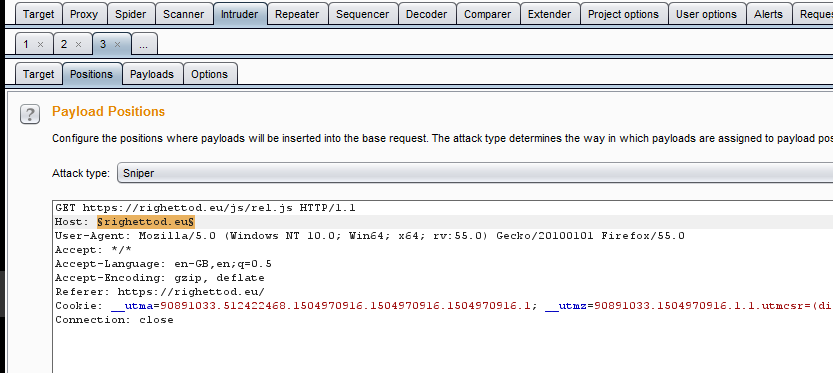
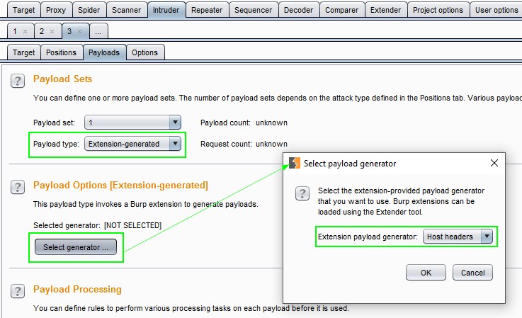
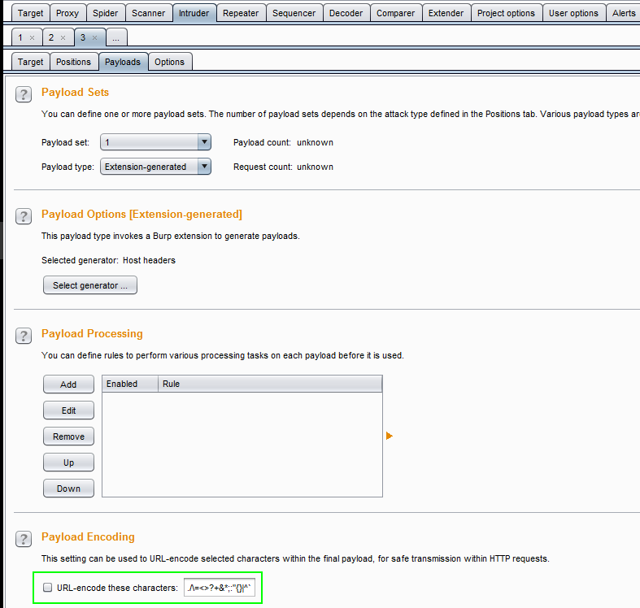
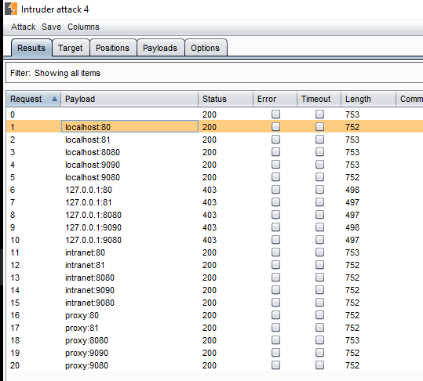

# Virtual Host Payload Generator

Burp extension providing a set of values for the HTTP request **Host** header for the *Burp Intruder* in order to abuse virtual host resolution.

It's based on the information provided by this article from the Burp team: [Cracking the Lens: Targeting HTTP's Hidden Attack-Surface ](http://blog.portswigger.net/2017/07/cracking-lens-targeting-https-hidden.html)

The idea of the extension is to use the Burp Intruder in order to identify different responses when Host header is abused and then find an potential attack surface.

# Usage

**Step 1**: Send a request to the Intruder then set a placeholder on the **Host** header and replace the relative URL by the absolute version of the URL on the first line:



**Step 2**: Select the **Payload Sets** from an **Extension-generated** type and select the **Host headers** extension payload generator.

Do not forget to uncheck the **Payload Encoding** option:





**Step 3**: Launch the attack, you can ignore the warning `The Host header in the request does not match the specified target host` because it's normal in our execution context.

You will see the different responses code, content and size according to the **Host** header value used as payload:



# Payloads

Payload are stored in the properties file named **virtualhost-payload-generator-config.properties**, precisely in the following keys:

```
# List (separated by a comma) of the host names to use
host.header.names=localhost,127.0.0.1,intranet,proxy
# List (separated by a comma) of the host ports to use
host.header.ports=80,81,8080,9090,9080
```

# Build the extension

The extension is developed using IntelliJ IDEA Community Edition.

Use the following Maven command `mvn clean package`.

The extension will be available, as a jar file, in the **target** folder.
